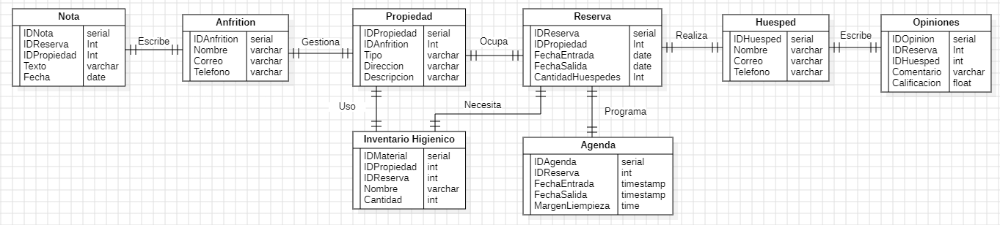

# Proyecto final de curso DAM 23-24: HospedaFácil
Una agenda de días disponibles, entradas y salidas de huéspedes, horarios de la misma con margen de limpieza y material higiénico necesarias para la limpieza (cortinas, sabanas, toallas, papel higiénico, etc.) de acuerdo a la cantidad de huéspedes hospedados.
Calendario anual, mensual y semanal para el correcto funcionamiento de días ocupados por cada casa, un apartado de notas para apuntar observaciones, poder ver las opiniones y sugerencias de huéspedes.

## Modelo de Datos

[Modelo de datos (archivo StarUML)](anteProyecto.mdj)

[Ejemplo de modelo de datos (archivo docs)](modeloEjemplo.ods)

## Mockup Figma

[Mockup (archivo Figma)](Anteproyecto.fig)